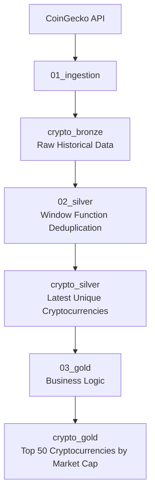
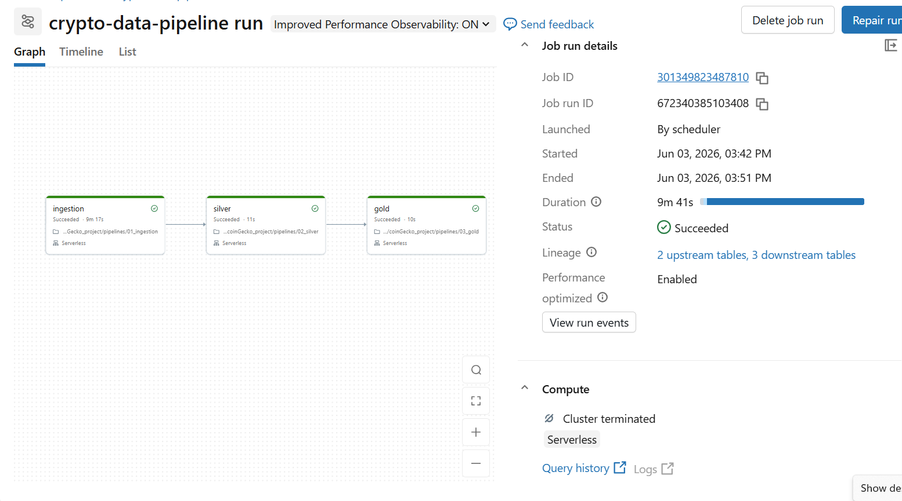
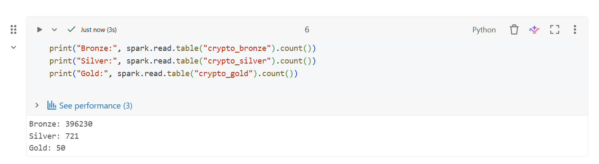
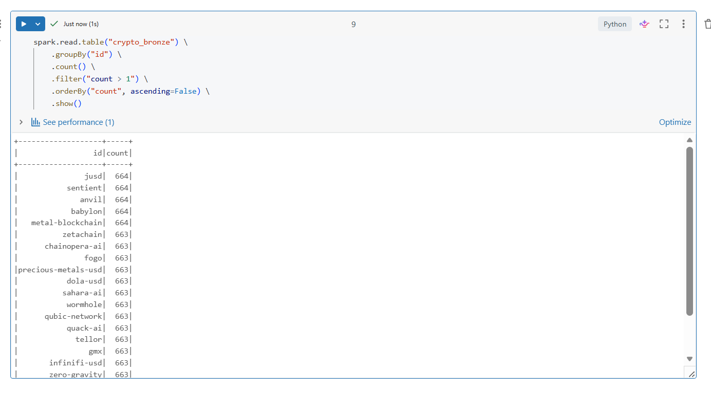
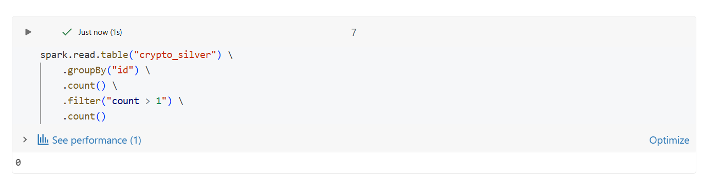
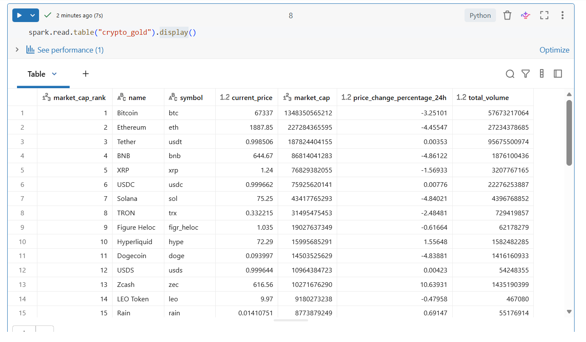

# Crypto Data Pipeline

## Project Overview

This project is an end-to-end cryptocurrency data pipeline built using Databricks, PySpark, Delta Lake, and the CoinGecko API.

The pipeline follows the Medallion Architecture (Bronze, Silver, Gold) pattern and automates the ingestion, transformation, and serving of cryptocurrency market data.

The workflow runs on a scheduled basis, continuously collecting data from CoinGecko, storing historical records, removing duplicates, and creating a business-ready dataset of the top cryptocurrencies by market capitalization.

---

## Architecture



## Technology Stack

- Python
- PySpark
- Databricks
- Delta Lake
- CoinGecko REST API
- Databricks Workflows
- GitHub

---

## Project Structure

```text
crypto-data-pipeline
│
├── notebooks
│   ├── 01_ingestion.py
│   ├── 02_silver.py
│   ├── 03_gold.py
│   └── common_utils.py
│
├── screenshots
│   ├── workflow_success.png
│   ├── table_counts.png
│   ├── bronze_duplicates.png
│   ├── silver_deduplication.png
│   └── gold_layer_output.png
│
├── docs
├── sample_data
├── README.md
└── .gitignore
```

---

## Bronze Layer

The Bronze layer stores raw cryptocurrency data retrieved from the CoinGecko API.

Features:

- REST API ingestion
- Pagination handling
- Rate limit handling
- Append-only storage
- Historical data retention

Current volume:

- 396,230+ raw records

---

## Silver Layer

The Silver layer removes duplicate cryptocurrency records and keeps only the latest version of each coin.

Deduplication is implemented using a PySpark Window Function.

```python
window = Window.partitionBy("id") \
    .orderBy(col("ingestion_time").desc())

silver_df = bronze_df.withColumn(
    "rank",
    row_number().over(window)
).filter(
    "rank = 1"
).drop("rank")
```

Results:

- 721 unique cryptocurrencies
- Zero duplicate records

---

## Gold Layer

The Gold layer creates a business-ready dataset containing the Top 50 cryptocurrencies ranked by market capitalization.

Columns included:

- market_cap_rank
- name
- symbol
- current_price
- market_cap
- price_change_percentage_24h
- total_volume

Business Use Case:

Provide a curated view of the largest cryptocurrencies and their market performance.

Current output:

- Top 50 cryptocurrencies

---

## Workflow Automation

The entire pipeline is orchestrated using Databricks Workflows.

Execution order:

```text
01_ingestion
      ↓
02_silver
      ↓
03_gold
```

The workflow can be scheduled to run automatically at defined intervals.

---

## Results

| Layer | Records |
|---------|---------:|
| Bronze | 396,230+ |
| Silver | 721 |
| Gold | 50 |

---

## Screenshots

### Workflow Success



### Layer Counts



### Bronze Historical Records



### Silver Deduplication Validation



### Gold Layer Output



---

## Key Data Engineering Concepts Demonstrated

- REST API Integration
- Incremental Data Loading
- Pagination
- Rate Limit Handling
- Delta Lake
- Medallion Architecture
- Window Functions
- Data Deduplication
- Databricks Workflows
- Pipeline Automation
- GitHub Version Control

---

## Future Enhancements

Potential improvements:

- Implement incremental MERGE strategy
- Add data quality validation checks
- Create cryptocurrency trend dashboards
- Add monitoring and alerting
- Integrate cloud storage
- Add unit testing framework
- Implement CI/CD deployment pipeline

---

## Author

Punit Tiwari

Data Analyst | Big Data Engineer

